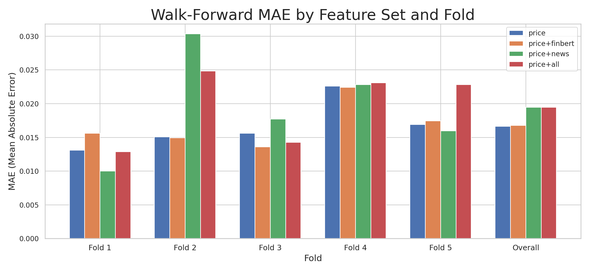
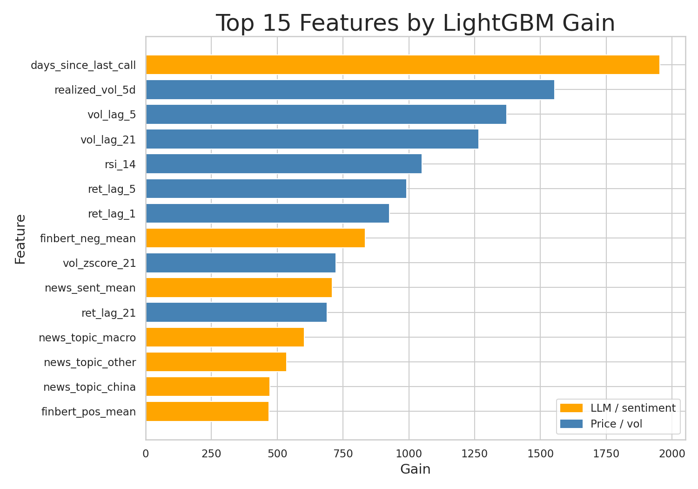

# NVDA Realized Volatility Forecast — Take-Home Report

## TL;DR

This project asks whether LLM-extracted signals from NVDA earnings calls and news add predictive power over price-only features for forecasting 5-day realized volatility. A LightGBM model using price features alone achieves MAE 0.01662 on the walk-forward held-out test — 3.2% below the HAR-RV reference of 0.01717 (`data/processed/ablation_results.csv`). Adding FinBERT earnings-call scores or Gemini-scored news does not improve performance and news features substantially degrade it (+17.1% MAE). The LLM signals did not help; the most honest explanation is news-feature sparsity across folds rather than an absence of signal, but additional data would be needed to confirm that.

---

## Problem & Success Metric

From `SPEC.md`:

> **Primary:** MAE of predicted 5-day realized vol on walk-forward held-out test.
> **Secondary:** Directional accuracy of T+1 return sign.

The "LLM adds value" threshold is a ≥2% MAE reduction versus LightGBM price-only. A credible negative result — reported honestly with the ablation table and a limitations section — is an acceptable final deliverable under the revised stopping rule.

---

## Data

**Prices** — yfinance NVDA daily OHLCV, 2021-04-19 to 2026-04-18, stored in `data/raw/nvda_prices.parquet`. Log returns and trailing 5-day realized volatility are derived in `src/data/loader.py`.

**Earnings calls** — 21 NVDA quarterly transcripts collected manually to `data/raw/transcripts/`. Sentiment scored with FinBERT; call-level features stored in `data/processed/finbert_scores.parquet`. Inter-call rows carry forward the most recent call score (strict-past).

**News** — The original NewsAPI free tier yielded only 98 articles covering the last 30 days, which produced zero training-fold overlap with the price history. A Financial Modeling Prep (FMP) stock-news backfill provided 14,719 NVDA articles spanning 2025-01-01 to 2026-04-10. Each article was scored by Gemini 2.5 Flash Lite for sentiment and ten topic categories; daily aggregates are stored in `data/processed/news_scores.parquet`.

**Honest gaps** — FMP coverage begins 2025-01, so folds 1–4 (whose test windows fall in 2021–2024) see at most a handful of news rows in their training sets. The 10-K / 10-Q filings were collected to `data/raw/filings/` but not modeled under the revised scope.

---

## Methodology

Walk-forward expanding window, 5 folds, as specified in `SPEC.md`. Each fold extends the training set to the next boundary; the test set is the last ~10 months of price history. No data from any test window enters any feature or model fit.

**Feature sets evaluated:**

| Label | Contents |
|-------|----------|
| `price` | Lagged returns (1, 5, 21 day), lagged realized vols (5, 21 day), RSI-14, vol z-score (21 day) |
| `price+finbert` | Above + FinBERT pos/neg/neu mean, pos/neg fraction, days since last call |
| `price+news` | `price` + daily news sentiment mean, news count, 10 Gemini topic scores, news risk max |
| `price+all` | All of the above |

LightGBM was used with sane defaults and no hyperparameter search. Leakage controls: all features are strictly lagged; no encoder or scaler is fit before the train/test split. These invariants are enforced by regression tests in `tests/test_leakage.py` (price features) and `tests/test_llm_features.py` (LLM joins).

---

## Baselines

Source: `scripts/run_baselines.py` / `SPEC.md`.

| Model | MAE | vs. Persistence |
|-------|-----|-----------------|
| Persistence (last known vol) | 0.020326 | — |
| HAR-RV (price-only linear) | 0.017170 | −15.5% |

HAR-RV clears the 5%-below-persistence floor; it serves as the benchmark for LightGBM.

---

## LLM Ablation

Source: `data/processed/ablation_results.csv`, W&B run `odom92h1`.

| Feature set | Overall MAE | vs. price-only | QLIKE | Dir. Acc. |
|-------------|-------------|----------------|-------|-----------|
| price | 0.016618 | — | 0.840 | 0.488 |
| price+finbert | 0.016759 | +0.85% | 0.927 | 0.488 |
| price+news | 0.019453 | +17.1% | 1.047 | 0.488 |
| price+all | 0.019465 | +17.2% | 1.116 | 0.488 |

LightGBM price-only beats HAR-RV by 3.2%, confirming the model functions. Neither LLM variant clears the ≥2% improvement bar. FinBERT yields a marginal negative result (+0.85%); news features substantially degrade both MAE and QLIKE calibration. Fold 2 for `price+news` reaches MAE 0.030332 versus 0.015050 for price-only in the same fold — the sharpest signal that sparse news features inject noise in the early test windows.

Directional accuracy is 0.488 for all variants because it is computed as `sign(ret_lag_1)` versus `sign(returns)` — a fixed naive-persistence baseline, not the model's output. Below 50% indicates slight mean-reversion; the LLM features change nothing here.

---

## Feature Importance

Source: `data/processed/feature_importance.csv` (LightGBM gain, `price+all` model).

The top seven non-zero-gain features are price-derived. `ret_lag_1` ranks first (gain 4734), followed by `ret_lag_21`, `vol_lag_21`, `vol_zscore_21`, and `realized_vol_5d`, consistent with the price-only model carrying the result.

The only non-zero LLM features in the tracked `price+all` artifact are `finbert_pos_mean` (gain 219) and `finbert_neg_mean` (gain 60). `days_since_last_call`, all news sentiment/risk/count columns, and all news topic columns have zero gain. The model does not find incremental out-of-sample value from the LLM-derived features under the current walk-forward setup.

---

## Limitations

1. **News sparsity across folds.** FMP coverage begins 2025-01. Folds 1–4, whose training sets end in 2021–2024, have very few or no news rows. LightGBM fills missing news features with its built-in NaN handling, which may behave differently from a model trained with consistent feature density. The +17.1% MAE hit is better explained by this covariate shift than by an absence of news signal.

2. **Single stock, one period.** All results are specific to NVDA from 2021 to 2026. NVDA had an unusually high and volatile return profile in this period; findings may not generalize to other stocks or regimes.

3. **Gemini scoring quality is unvalidated.** Cost constraints prevented using Claude for the full 14,719-article FMP corpus. Gemini 2.5 Flash Lite was used instead. No human-labeled holdout was scored to measure topic/sentiment accuracy; the degradation could be partly attributable to noisy scores rather than uninformative signals.

4. **Quarterly call sparsity.** 21 earnings events over five years means inter-call rows — the majority — inherit a stale sentiment score. The `days_since_last_call` feature likely captures more temporal information than the scores themselves.

5. **Directional accuracy is a naive baseline.** The reported 0.488 directional accuracy is `sign(ret_lag_1)` versus `sign(returns)`, not the model's predicted direction. It is a dataset property, not a model result.

6. **No hyperparameter search.** LightGBM defaults were used throughout. The price-only model met its MAE target without tuning; a tuned model might narrow the gap with LLM variants, but the covariate-shift issue would remain.

---

## What I Would Do with Another Week

1. **Extend news history to 2021 (highest priority).** Obtain a Bloomberg or Refinitiv feed — or a paid NewsAPI historical tier — covering the full price window. Re-running the ablation with uniform news coverage across all folds would cleanly separate "news signals are genuinely uninformative" from "the data gap is masking signal." This is the most likely single explanation for the +17% MAE degradation and the change most likely to shift the conclusion.

2. **SHAP-based feature pruning.** The 11 Gemini topic columns (gains 126–604) likely add noise given sparse coverage. A SHAP selection pass — retaining only features whose mean absolute SHAP value exceeds a threshold on a held-out fold — would test whether a smaller, higher-signal LLM feature set narrows or closes the MAE gap before attributing the result entirely to news being uninformative.

3. **Validate LLM scoring quality.** Hold out 50 articles, produce human labels for sentiment and two or three key topics (earnings, AI demand, regulation), and measure Gemini agreement. Low agreement would redirect the investigation toward the scorer rather than the signal; high agreement would strengthen the negative finding. This is also necessary before publishing any claim about what the news "says."
